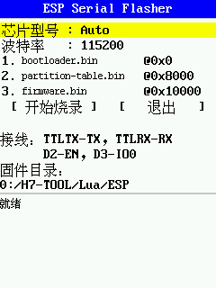

# ESP Serial Flasher Lua

H7-TOOL的ESP串口烧录小程序，当前支持`ESP8266`/`ESP32`/`ESP32-S2`/`ESP32-S3`/`ESP32-C2`/`ESP32-C3`/`ESP32-C5`/`ESP32-C6`/`ESP32-C61`/`ESP32-H2`/`ESP32-P4`。

## 特性

- ROM 模式：走芯片 ROM bootloader，没有加载stub，不过根据[esp官方的说法](https://github.com/espressif/esp-serial-flasher)，当主机上的闪存容量不是限制因素时，建议使用加载stub的方式，而非直接使用 ROM 引导加载程序进行连接。等后面再实现加载stub的方法，并且做一下对比。
- 支持芯片：`ESP8266`/`ESP32`/`ESP32-S2`/`ESP32-S3`/`ESP32-C2`/`ESP32-C3`/`ESP32-C5`/`ESP32-C6`/`ESP32-C61`/`ESP32-H2`/`ESP32-P4`，支持自动检测型号。
- 交互式UI界面：可以选择芯片型号，更改偏移量，执行烧录，查看进度和报错信息。

## 硬件接线

| H7-TOOL | ESP 芯片 | 说明 |
|---------|----------|------|
| TTLTX | ESP RX | 交叉连接 |
| TTLRX | ESP TX | 交叉连接 |
| D2 | EN / RST | 复位控制 |
| D3 | GPIO0 (BOOT) | 下载模式选择 |
| TVCC | VCC | 供电，默认 3.3V |

## 固件文件

默认从地址`PATH`读取三个固件，注意固件命名必须保持规范一致，默认是 `0:/H7-TOOL/Lua/ESP` ：

| 文件 | 默认偏移 |
|------|----------|
| `bootloader.bin` | `0x0000` |
| `partition-table.bin` | `0x8000` |
| `firmware.bin` | `0x10000` |

- 可自行更改脚本中的`PATH`来更改固件默认地址。
- 可通过UI界面更改偏移量，可选的包括0x00000/0x01000/0x08000/0x0E000/0x10000/0x100000/0x200000/0x300000/0x400000。

## 部署到 H7-TOOL

1. 把 `esp_serial_flasher.lua` 拷到 H7-TOOL 的 Lua 脚本目录，比如 `0:/H7-TOOL/Lua/`。
2. 把固件 `.bin` 放到 `PATH`。
3. 在 H7-TOOL 上运行该 Lua 脚本。

## UI 操作

| 按键 | 作用 |
|------|------------|
| ↑ | 上移光标 |
| ↓ | 下移光标 |
| OK | 执行动作/切换参数 |
| C | 长按退出程序 |
| HOME | 退出程序 |

## 故障排查

- SYNC 握手失败：检查 TX/RX 是否交叉、EN/BOOT 接线是否正确、波特率是否过高；可先降到 `115200` 再试。
- 读不到文件：确认路径正确，且 H7-TOOL 未处于 U 盘挂载模式。
- 芯片错误：确认菜单所选型号与实际硬件一致，或改回 `Auto` 让它自动识别。

## 参考

- Espressif [`esp-serial-flasher`](https://github.com/espressif/esp-serial-flasher)
- 《H7-TOOL Lua 脚本 API 手册 V1.2》
